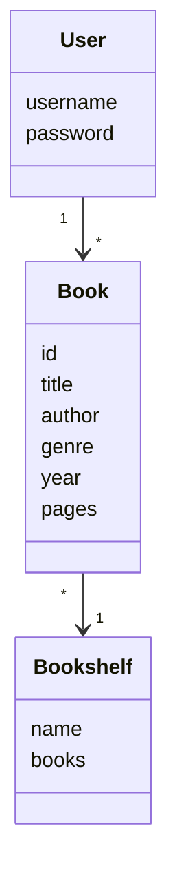
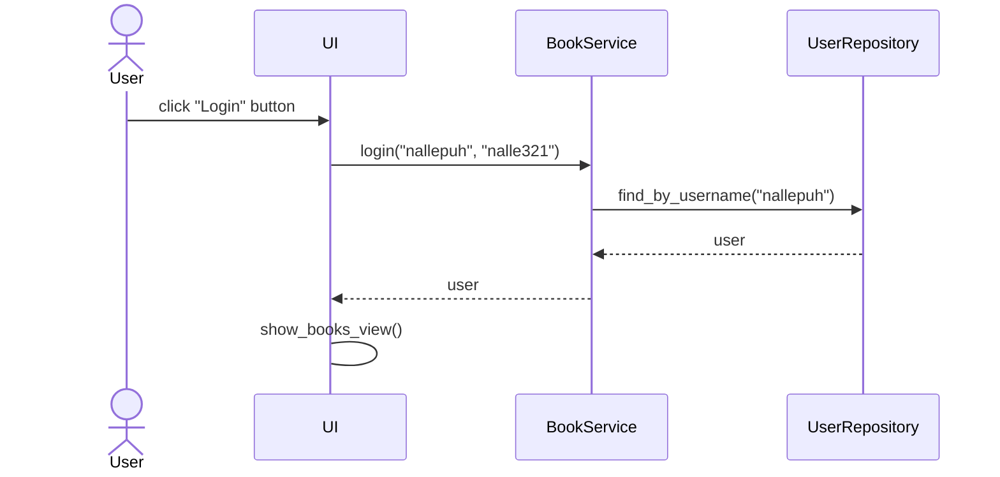

# Arkkitehtuurikuvaus

## Rakenne

Ohjelman rakenne noudattaa kolmitasoista kerrosarkkitehtuuria.
Koodin hakemistot ovat _ui_, _services_, _repositories_ ja _entities_.

Pakkaus _ui_ sisältää käyttöliittymän koodin, _services_ sovelluslogiikan koodin ja _repositories_ tietojen pysyväistallennuksen koodin. Pakkaus _entities_ taas sisältää luokkia, jotka kuvastavat sovelluksen käyttämiä tietokohteita.

## Sovelluslogiikka luokkakaaviona

Sovelluksessa ovat luokat _User_, _Book_ sekä _Bookshelf_. Alla oleva luokkakaavio kuvaa luokkien välisiä yhteyksiä:

Toiminnallisista kokonaisuuksista vastaa luokka _BookService_. Luokka tarjoaa käyttöliittymän toiminnoille omat metodinsa, kuten

- `login(username, password)`
- `create_book(title, bookshelf)`
- `get_books()`
- `delete_book(book_id)`

_BookService_ pystyy käyttämään käyttäjiä ja kirjoja pakkauksessa _repositories_ sijaitsevien luokkien _BookRepository_ ja _UserRepository_ avulla. Luokkien toteutukset injektoidaan _BookServicelle_ konstruktorikutsussa.

## Pysyväistallennus

Pakkauksen _repositories_ luokkien _BookRepository_ ja _UserRepository_ avulla sovelluksen tietoja voidaan tallentaa. _BookRepository_-luokka tallentaa tietoa suoraan CSV-tiedostoon ja _UserRepository_-luokka tallentaa tietoa SQLite-tietokantaan.

## Päätoiminnallisuudet

### Käyttäjän kirjautuminen

Kun käyttäjä syöttää kenttiin käyttäjätunnuksen ja salasanan sekä painaa nappia _Login_, kirjataan käyttäjä sisään. Seuraava sekvenssikaavio kuvaa tarkemmin kirjautumista:

Sekvenssikaaviot sovelluksen muista toiminnallisuuksista lisätään piakkoin.
