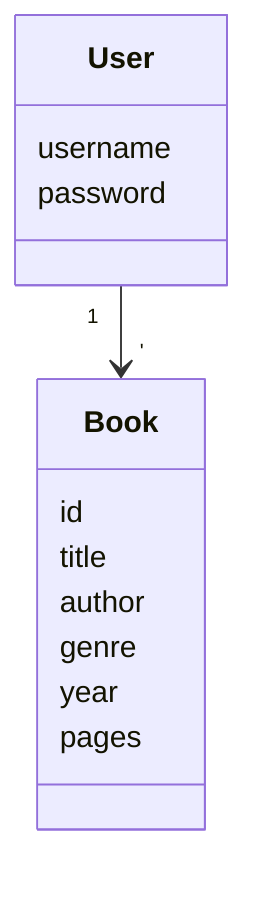

## Alustava sovelluksen luokkakaavio

Tämänhetkinen arkkitehtuuri alla. Tulevaisuudessa käyttäjällä tulee olemaan eri kirjahyllyjä (want to read, reading, read) ja
kirjahyllyissä kirjoja.

```mermaid
 classDiagram
      User "1" --> "'" Book
      class User{
          username
          password
      }
      class Book{
          id
          title
          author
          genre
          year
          pages
      }
```
