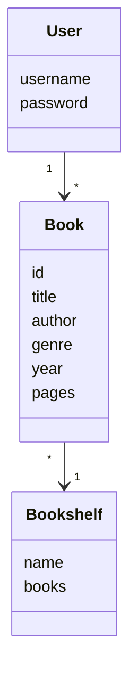
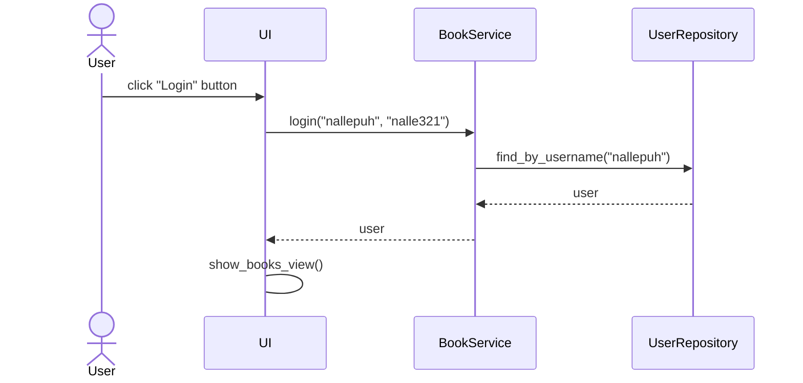
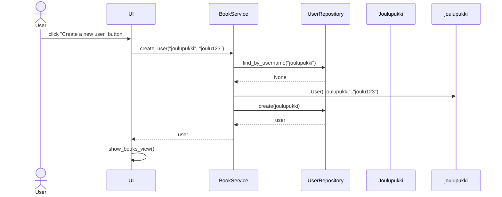
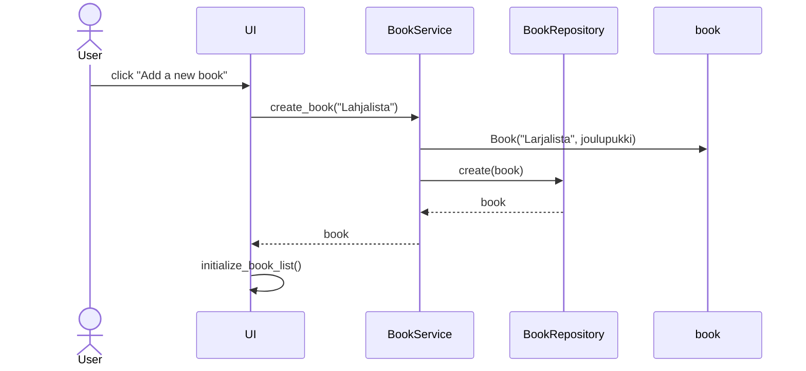

# Arkkitehtuurikuvaus

## Rakenne

Ohjelman rakenne noudattaa kolmitasoista kerrosarkkitehtuuria.
Koodin hakemistot ovat _ui_, _services_, _repositories_ ja _entities_.

Pakkaus _ui_ sisältää käyttöliittymän koodin, _services_ sovelluslogiikan koodin ja _repositories_ tietojen pysyväistallennuksen koodin. Pakkaus _entities_ taas sisältää luokkia, jotka kuvastavat sovelluksen käyttämiä tietokohteita.

## Käyttöliittymä

Sovelluksessa on kolme erillistä näkymää:
- Kirjautuminen
- Uuden käyttäjän rekisteröityminen
- Sovelluksen 'main page', jossa näkyy käyttäjän kirjahyllyt ja lomake kirjojen lisäämiseen

Jokainen näkymä on toteutettu omana luokkanaan ja näkymien näyttämisestä vastaa luokka _Ui_. Käyttöliittymä on eriytetty sovelluslogiikasta.

## Sovelluslogiikka luokkakaaviona

Sovelluksessa ovat luokat _User_, _Book_ sekä _Bookshelf_. Alla oleva luokkakaavio kuvaa luokkien välisiä yhteyksiä:

Toiminnallisista kokonaisuuksista vastaa luokka _BookService_. Luokka tarjoaa käyttöliittymän toiminnoille omat metodinsa, kuten

- `login(username, password)`
- `create_book(title, bookshelf)`
- `get_books()`
- `delete_book(book_id)`

_BookService_ pystyy käyttämään käyttäjiä ja kirjoja pakkauksessa _repositories_ sijaitsevien luokkien _BookRepository_ ja _UserRepository_ avulla. Luokkien toteutukset injektoidaan _BookServicelle_ konstruktorikutsussa.

## Pysyväistallennus

Pakkauksen _repositories_ luokkien _BookRepository_ ja _UserRepository_ avulla sovelluksen tietoja voidaan tallentaa. _BookRepository_-luokka tallentaa tietoa suoraan CSV-tiedostoon ja _UserRepository_-luokka tallentaa tietoa SQLite-tietokantaan.

Sovellus tallentaa käyttäjien ja kirjojen tiedot erillisiin tiedostoihin. Konfiguraatiotiedosto _.env_ määrittelee niiden tiedostojen nimet, joihin tiedot talletetaan.

- Kirjat talletetaan CSV-tiedostoon
- Käyttäjät talletetaan SQLite-tietokantaan tauluun _users_, joka alustetaan _initialize-database.py_-tiedostossa

## Päätoiminnallisuudet

### Käyttäjän kirjautuminen

Kun käyttäjä syöttää kenttiin käyttäjätunnuksen ja salasanan sekä painaa nappia _Login_, kirjataan käyttäjä sisään. Seuraava sekvenssikaavio kuvaa tarkemmin kirjautumista:

Tapahtumakäsittelijä kutsuu _BookRepository_-luokan metodia _login_, jolloin _BookRepository_ selvittää _UserRepositoryn_ kautta onko käyttäjää olemassa. Jos käyttäjä on olemassa ja salasanat täsmäävät, kirjataan käyttäjä sisään ja vaihdetaan näkymäksi _BooksView_ (eli sovelluksen 'main page').

### Uuden käyttäjän rekisteröityminen

Kun rekisteröitymisnäkymässä käyttäjä täyttää uuden uniikin käyttäjätunnuksen sekä salasanan näkymän kenttiin ja painaa _Create a new user_ -nappia, etenee sovellus seuraavasti:

Tapahtumakäsittelijä kutsuu _BookRepository_-luokan metodia _create_user_, jolloin _BookRepository_ selvittää _UserRepositoryn_ kautta onko käyttäjää olemassa. Jos käyttäjää ei ole vielä olemassa, luodaan uusi _User_-olio ja talletetaan uusi käyttäjä kutsumalla _UserRepositoryn_ metodia _create_. Tämän jälkeen käyttäjä kirjataan automaattisesti sisään ja vaihdetaan näkymäksi _BooksView_.

### Uuden kirjan lisääminen kirjahyllyyn

Kun käyttäjä täyttää kirjan nimen lomakkeeseen, valitsee yhden kolmesta kirjahyllystä ja painaa _Add a new book _-nappia, seuraa seuraavat tapahtumat:

Tapahtumakäsittelijä kutsuu _BookRepositoryn_ metodia _create_book_, joka saa parametreiksi luotavan kirjan tiedot (kuten Title, User jne.). _BookRepository_ luo uuden Book-olion ja tallettaa sen _create_-metodia kutsumalla. Tämän jälkeen käyttöliittymä päivittää näkyvät kirjahylyt kutsumalla käyttöliittymän metodia _initialize_book_list_.
