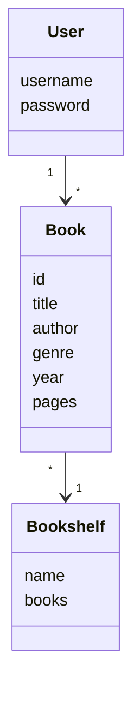
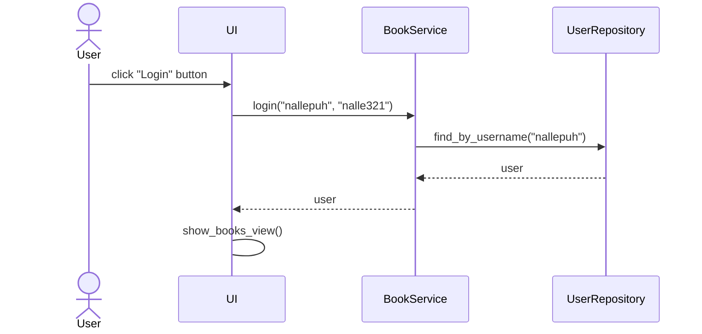

# Arkkitehtuurikuvaus

## Sovelluslogiikka luokkakaaviona

Sovelluksessa on luokat User, Book sekä Bookshelf. Alla oleva luokkakaavio kuvaa luokkien välisiä yhteyksiä:

## Päätoiminnallisuudet

### Käyttäjän kirjautuminen

Kun käyttäjä syöttää kenttiin käyttäjätunnuksen ja salasanan sekä painaa nappia _Login_, kirjataan käyttäjä sisään. Seuraava sekvenssikaavio kuvaa tarkemmin kirjautumista:

Sekvenssikaaviot sovelluksen muista toiminnallisuuksista lisätään piakkoin.
