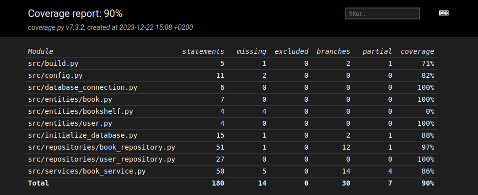

# Testausdokumentti

Sovelluksen testaus on hoidettu sekä automatisoidusti yksikkö- ja integraatiotasolla että manuaalisesti järjestelmätasolla.

## Yksikkö- ja integraatiotestaus

### Sovelluslogiikka

_BookService_-luokka on testattu _TestBookService_-testiluokan avulla. _BookServiceä_ testataan luokkien _FakeBookRepositoryn_ ja
_FakeUserRepositoryn_ avulla, jotka mahdollistavat _BookService_-olion alustamisen injektoimalla riippuvuksiksi repositorio-oliot, jotka
tallentavat tietoa muistiin pysyväistallennuksen sijasta.

### Reposiories

_BookRepository_- ja _UserRepository_-luokkia testataan vain testien aikaisilla tiedostoilla, jotka on konfiguroitu _.env.test_-tiedostoon.

### Testikattavuus

Sovelluksen testien haaraumakattavuus on 90%: 

## Järjestelmätestaus

Sovelluksen järjestelmätestaus on suoritettu manuaalisesti:

- sovelluksen tarjoamat toiminnallisuudet on testattu manuaalisesti, testausta on suoritettu myös virheellisillä arvoilla
- sovelluksen asentamista ja konfigurointia on myös testattu käyttöohjetta apuna käyttäen
