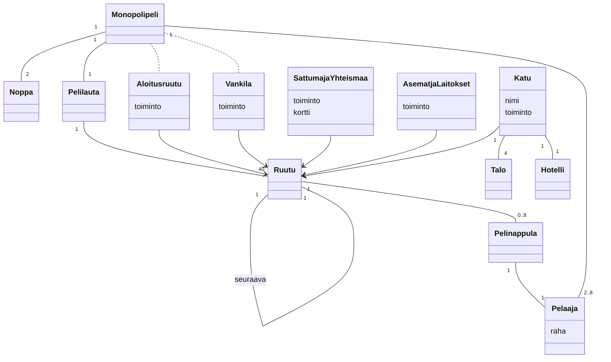

## Monopoli, alustava luokkakaavio

```mermaid
 classDiagram
    Monopolipeli "1" -- "2" Noppa
    Monopolipeli "1" -- "1" Pelilauta
    Pelilauta "1" -- "40" Ruutu
    Ruutu "1" -- "1" Ruutu : seuraava
    Ruutu "1" -- "0..8" Pelinappula
    Pelinappula "1" -- "1" Pelaaja
    Pelaaja "2..8" -- "1" Monopolipeli
    Aloitusruutu --> Ruutu
    Vankila --> Ruutu
    SattumajaYhteismaa --> Ruutu
    AsematjaLaitokset --> Ruutu
    Katu --> Ruutu
    Monopolipeli .. Aloitusruutu
    Monopolipeli .. Vankila
    Katu "1" -- "4" Talo
    Katu "1" -- "1" Hotelli

    class Katu{
          nimi
          toiminto
      }
    class Aloitusruutu{
          toiminto
      }
    class SattumajaYhteismaa{
          toiminto
          kortti
      }
    class AsematjaLaitokset{
          toiminto
      }
    class Vankila{
          toiminto
      }
    class Pelaaja{
          raha
      }
```
